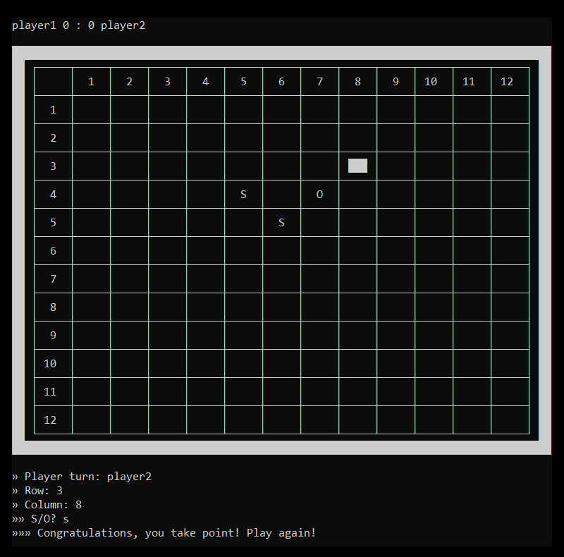

Tek bir komut konsolu ekranında 2 oyuncunun sos oyunu oynamasını sağlar. Oyun tahtasının boyutu `boyut` değişkeni üzerinden değiştirilebilir. Öncelikle oyunculardan isimleri alınır. Ardından oyunuculardan doldurmak istedikleri kutucuğun satır ve sütun numaraları alınır. Eğer numaraları alınan kutucuk var ve boş ise oyuncudan S (s) veya O (o) harfi girmesi beklenir. S (s) veya O (o) dışında karakter girilirse oyuncudan tekrar kutucuk ve harf alınır. Eğer oyuncu S (s) veya O (o) harfi girmişse puan alıp almadığı kontrol edilir. Puan almamışsa sıra diğer oyuncuya geçer, almışsa sıra aynı oyuncudan devam eder. Tüm kutular dolana kadar oyun devam eder. Tüm kutular dolduktan sonra puanı daha fazla olan oyuncu oyunu kazanır.

